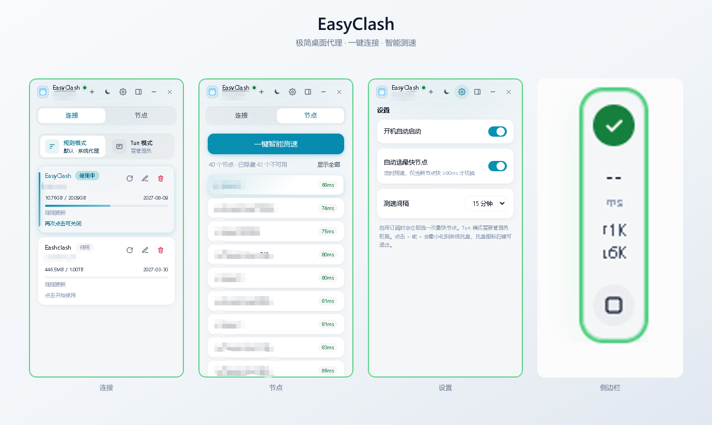
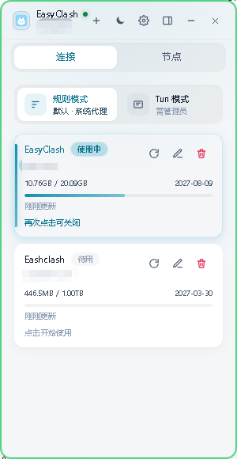
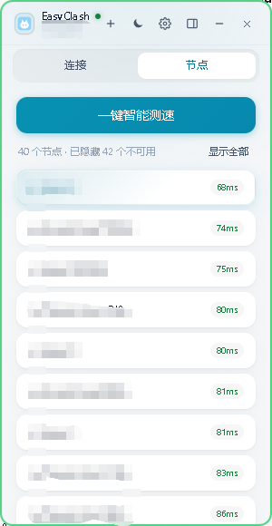
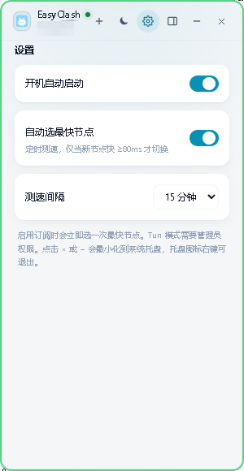

# EasyClash

极简的代理工具。[GitHub](https://github.com/zhang673101454/EasyClash)

极简桌面代理客户端：打开开关即可代理，一键测速并选择延迟最低的节点。










技术栈：Go + Wails v2 + Vue 3 + Pinia + TailwindCSS，底层引擎为 [mihomo](https://github.com/MetaCubeX/mihomo)（Clash.Meta）。安装包已内置 `mihomo.exe`；如果只用绿色版 exe，需要自行把内核放到同一目录。

---

## 1. 环境要求

在 **cmd** 中检查：

```bat
go version
node -v
npm -v
wails version
```

| 工具 | 要求 |
|------|------|
| Go | 1.21+（[官网下载 Windows amd64](https://go.dev/dl/)） |
| Node.js | 18+ |
| Wails CLI | v2.15.0 |
| WebView2 | Windows 10/11 一般已自带 |
| NSIS | 打安装包时才需要，见第 4 节 |

### 1.1 安装 Wails CLI

```bat
go install github.com/wailsapp/wails/v2/cmd/wails@v2.15.0
```

把 `%USERPROFILE%\go\bin` 加入用户 Path（一般为 `C:\Users\你的用户名\go\bin`），然后重开终端：

```bat
wails version
wails doctor
```

---

## 2. 准备 mihomo 内核

应用不会自己实现代理协议，运行时要能找到 `mihomo.exe`。任选一处放置即可：

开发时（`wails dev`）：

- 项目根目录：`e:\code\easy-clash\mihomo.exe`
- 或：`e:\code\easy-clash\resources\mihomo.exe`
- 或：已加入系统 Path，命令名为 `mihomo`

打包后（双击 exe）：

- 与 `EasyClash.exe` 同一目录
- 或该目录下的 `resources\mihomo.exe`

下载： [mihomo Releases](https://github.com/MetaCubeX/mihomo/releases) ，选 Windows amd64，例如 `mihomo-windows-amd64.zip`，解压出 `mihomo.exe` 后改名或直接放到上述目录。

首次启动会把默认配置写到：

```
%APPDATA%\EasyClash\config.yaml
```

一般是 `C:\Users\你的用户名\AppData\Roaming\EasyClash\config.yaml`。

**订阅在界面里设置：** 连接页点右上角 `+`，粘贴 Clash / mihomo 订阅 URL 后点「确认添加」。点一条订阅即可开始使用，再点同一条则关闭。  
「节点」页可查看可用节点并点击切换；先点订阅开始使用后，节点列表才会加载。

---

## 3. 怎么运行（开发）

在项目根目录打开 **cmd**：

```bat
cd /d e:\code\easy-clash
wails dev
```

第一次会执行 `frontend` 的 `npm install` 和 Vite 热更新。成功后弹出 350×500 的无边框窗口。

日常操作：

- 点中间大开关：启动/停止 mihomo，并开关系统代理（`127.0.0.1:7890`）
- 点「一键智能测速」：对节点组测速并切到延迟最低的节点
- 点右上角 ×：窗口隐藏到托盘，**不会退出**
- 托盘菜单：显示主窗口 / 开启关闭代理 / **退出**

真正退出必须用托盘「退出」，否则进程还在。

### 只看前端界面（不连 Go 后端）

Go 绑定在浏览器里不可用，只能看 UI：

```bat
cd /d e:\code\easy-clash\frontend
npm install
npm run build
npx vite preview --host 127.0.0.1 --port 4173
```

浏览器打开 `http://127.0.0.1:4173/`。点开关会失败，属正常。

---

## 4. 怎么打包

先把 `mihomo.exe` 和 `wintun.dll` 放到 `resources\`（见第 2 节），安装包脚本会把它们打进去。

TUN 依赖的 `wintun.dll` 官方来源：[https://www.wintun.net/](https://www.wintun.net/)（下载 zip 后取 `bin\amd64\wintun.dll`）。也可用脚本：

```bat
powershell -ExecutionPolicy Bypass -File scripts\fetch-wintun.ps1
```

开启 TUN 需要**以管理员身份运行** EasyClash。

### 4.1 绿色版 exe

```bat
cd /d e:\code\easy-clash
wails build -platform windows/amd64 -trimpath -ldflags "-s -w"
```

产物：

```
e:\code\easy-clash\build\bin\EasyClash.exe
```

大约 12 MB。不要加 `-webview2 embed`，否则会把 WebView2 打进去，体积暴涨。已安装 [UPX](https://upx.github.io/) 时可再加 `-upx`。

分发绿色版时，把这些放在同一文件夹：

```
SomeFolder\
  EasyClash.exe
  mihomo.exe          （或 resources\mihomo.exe）
  wintun.dll          （TUN 模式需要；官方 https://www.wintun.net/）
```

### 4.2 安装包（推荐）

1. 安装 [NSIS](https://nsis.sourceforge.io/) 3.x。可用：

```bat
winget install --id NSIS.NSIS -e --source winget
```

装完后确认 `makensis` 能找到（必要时把 `C:\Program Files (x86)\NSIS` 加入 Path）：

```bat
makensis /VERSION
```

2. 确认 `resources\mihomo.exe` 与 `resources\wintun.dll` 已存在。`project.nsi` 会把它们复制到安装目录。

3. 在项目根目录打包：

```bat
cd /d e:\code\easy-clash
wails build -platform windows/amd64 -nsis -trimpath -ldflags "-s -w"
```

产物：

```
e:\code\easy-clash\build\bin\EasyClash.exe
e:\code\easy-clash\build\bin\EasyClash-amd64-installer.exe
```

`EasyClash-amd64-installer.exe` 就是安装包（约 24 MB，已内置 mihomo）。双击安装后会写入「程序文件」、开始菜单和桌面快捷方式。对方电脑一般已有 WebView2。

`wails.json` 里 `nsisType` 保持为空即可，不要写成 `offline`（当前 Wails 2.15 不支持该值）。

正式发布可把安装包上传到 GitHub Release，例如：

https://github.com/zhang673101454/EasyClash/releases/tag/v1.0.0

---

## 5. 常用命令一览

```bat
rem 环境自检
wails doctor

rem 开发运行
wails dev

rem 绿色版 exe
wails build -platform windows/amd64 -trimpath -ldflags "-s -w"

rem 安装包（需先安装 NSIS，并把 mihomo.exe 放到 resources\）
wails build -platform windows/amd64 -nsis -trimpath -ldflags "-s -w"

rem 只编前端
cd frontend
npm run build
```

---

## 6. 常见问题

**Q: Cursor / 终端里找不到 `go` 或 `wails`？**  
把 Go 安装目录的 `bin` 和 `%USERPROFILE%\go\bin` 加入 Path，然后重启 Cursor。

**Q: 点开关提示找不到 mihomo？**  
按第 2 节把 `mihomo.exe` 放到程序目录或 `resources\`。打安装包前也要放在 `resources\mihomo.exe`。

**Q: 订阅在哪填？**  
连接页点右上角 `+`，粘贴订阅 URL 后点「确认添加」。不要改 `external-controller`，必须保持 `127.0.0.1:9090`。

**Q: 已连接但上不了网 / 测速失败？**  
先确认订阅已保存且机场链接可用。节点写在 `%APPDATA%\EasyClash\config.yaml` 的 `proxy-providers` 里。

**Q: 关窗口后任务栏没了，也关不掉？**  
程序在系统托盘。右键托盘图标选「退出」。

**Q: `wails build -nsis` 报 `Unsupported nsisType: offline`？**  
把 `wails.json` 里的 `nsisType` 改成空字符串 `""`。

**Q: `makensis not found` / 打不出安装包？**  
先安装 NSIS，并把 `C:\Program Files (x86)\NSIS` 加入 Path，重开终端后再打包。
